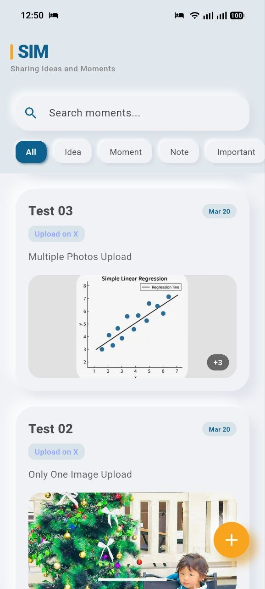
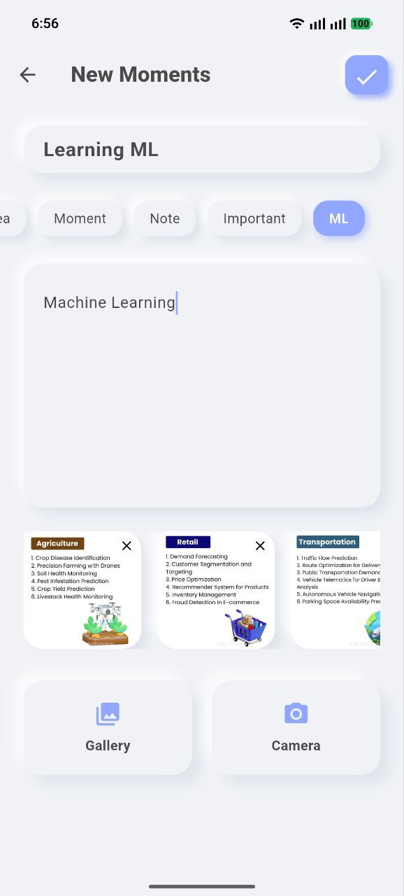
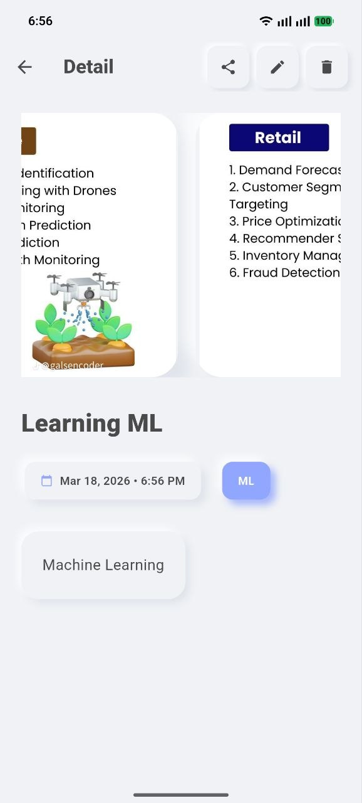
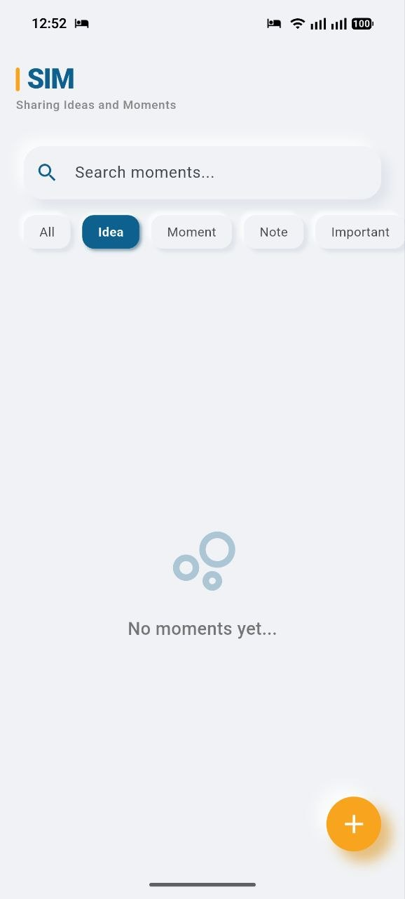
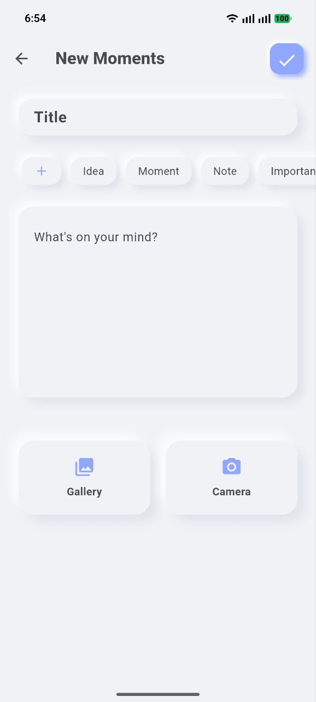

# Sharing Ideas and Moments (SIM)

[](#)
[](https://flutter.dev)

**Sharing Ideas and Moments (SIM)** is a modern, tactile mobile application designed for personal expression and memory keeping. Built with Flutter, it features a unique **Claymorphism** design aesthetic that provides a soft, 3D interactive experience.

---

## Design Philosophy: Claymorphism

SIM stands out with its **Claymorphism** UI—a blend of soft shadows, rounded corners, and pastel colors (like our signature `#91A6FF` blue). This design choice makes the digital interface feel physical and approachable, encouraging users to interact with their "moments."

## Screenshots

<div align="center">
  <h3>Home & Features</h3>
  
  
  
  <br>
  <i>Showcasing the soft Claymorphism UI and multimedia support.</i>
</div>

<br>

<div align="center">
  <h3>Empty States</h3>
  
  
</div>

## Key Features

- **Capture Moments**: Create title-based posts with rich content.
- **Multimedia Support**: Attach multiple images to your memories.
- **Categorization**: Organize your thoughts with custom categories.
- **Smart Search**: Quickly find past moments using the built-in search functionality.
- **X (Twitter) Auto-Upload**: Post your moments directly to X with a single click (Supports Text + Images).
- **Social Sharing**: Enhanced system sharing that includes titles and images for high-quality cross-platform posting.
- **Local Storage**: All data is stored securely on-device using `sqflite`, ensuring your privacy.

## X (Twitter) Integration Setup

> [!WARNING]
> **A Paid X API Plan is Required.**
> As of 2026, the X Free tier does NOT support automated posting or media uploads. You must have a **Basic** or **Pro** developer plan to use the "Auto-Upload" feature in this app.

The app uses **OAuth 2.0 PKCE** for a secure, modern connection to X.

### 1. Configure API Credentials
For security, API keys are NOT stored in the repository. Follow these steps:
1.  Locate `lib/config/twitter_config.dart.example`.
2.  Duplicate it and rename the copy to `lib/config/twitter_config.dart`.
3.  Open the new file and fill in your **Client ID**, **Consumer Key**, and **Consumer Secret** from the [X Developer Portal](https://developer.twitter.com/).

> [!IMPORTANT]
> `lib/config/twitter_config.dart` is automatically added to `.gitignore` to protect your paid account credits from being stolen on GitHub.

### 2. Android Deep Link Setup
The app uses `sim-app://callback` for OAuth redirection. This is already configured in `AndroidManifest.xml`. Ensure your X Developer App has this callback URL whitelisted in the "User Authentication" settings.

## Technical Stack

- **Framework**: [Flutter](https://flutter.dev) (Dart)
- **Database**: [sqflite](https://pub.dev/packages/sqflite) for high-performance local persistence.
- **UI Components**: Custom `ClayContainer` for the signature 3D effect.
- **Utilities**:
  - `image_picker` for camera and gallery access.
  - `share_plus` for native sharing capabilities.
  - `intl` for clean date and time formatting.

## Getting Started

This project is optimized for **Mobile platforms (Android and iOS)**.

### Prerequisites

- Flutter SDK (>= 3.11.0)
- Android Studio / VS Code with Flutter extension
- An Android Emulator or iOS Simulator

### Installation

1.  **Clone the repository**:
    ```bash
    git clone https://github.com/sut-seng-du/sharing-ideas-and-moments-mobile-application.git
    cd sharing-ideas-and-moments-mobile-application
    ```
2.  **Install dependencies**:
    ```bash
    flutter pub get
    ```
3.  **Run the application**:
    ```bash
    flutter run
    ```

---

## Platform Support

- **Android**: Fully supported and tested.
- **iOS**: Fully supported and tested.
- **Web/Desktop**: These platforms have been intentionally removed to keep the mobile experience lightweight and focused.

---

## License

This project is private and for internal use.
